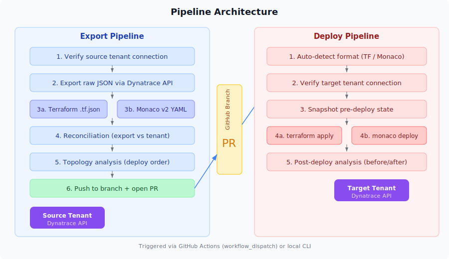

# Dynatrace Configuration Migration

Tools for exporting and deploying Dynatrace configuration between tenants, with support for both Terraform and Monaco formats.



## Two-Pipeline Architecture

Configuration management is split into two independent pipelines with Git as the intermediary:

- **Export Pipeline** — Pull configuration from a source tenant, transform to Terraform or Monaco format, push to a Git branch for review
- **Deploy Pipeline** — Read configuration from a Git branch, auto-detect the format, apply to a target tenant

This separation enables code review between export and deploy, version history of all configuration, and format-agnostic workflows.

## Quick Start

### Prerequisites

- **Python 3.8+** with pip
- **Terraform CLI 1.5+** (for Terraform format deployments)
- **Monaco CLI v2.12+** (for Monaco format deployments)
- **Git**

### Installation

```bash
# Install Python dependencies
pip install -r requirements.txt

# Set up environment variables
cp config/.env.example .env
nano .env  # Add tenant URLs and API tokens
```

### Export Configuration

```bash
# Export all config types as Terraform format
python pipelines/export.py \
    --types all \
    --format terraform \
    --output-dir exported

# Export only dashboards as Monaco format
python pipelines/export.py \
    --types dashboard \
    --format monaco \
    --output-dir exported \
    --reconcile \
    --topology

# List available config types
python pipelines/export.py --list-types
```

### Deploy Configuration

```bash
# Dry run (plan only)
python pipelines/deploy.py \
    --source-dir exported/terraform \
    --dry-run

# Apply to target tenant
python pipelines/deploy.py \
    --source-dir exported/terraform \
    --analyze
```

### GitHub Actions

Both pipelines are available as GitHub Actions workflows with `workflow_dispatch` inputs:

- **Export** (`.github/workflows/export.yml`) — Select config types, format, target branch. Opens a PR for review.
- **Deploy** (`.github/workflows/deploy.yml`) — Select source branch, config types, dry-run toggle. Auto-detects format.

Configure these secrets in your repository:

| Secret | Purpose |
|--------|---------|
| `SOURCE_TENANT_URL` | Source Dynatrace tenant URL |
| `SOURCE_TENANT_TOKEN` | Source tenant API token |
| `TARGET_TENANT_URL` | Target Dynatrace tenant URL |
| `TARGET_TENANT_TOKEN` | Target tenant API token |

## Project Structure

```
.
├── pipelines/                      # Export/Deploy pipeline system
│   ├── export.py                   # Export CLI
│   ├── deploy.py                   # Deploy CLI
│   ├── core/                       # Shared: API client, config, types
│   ├── export_pipeline/            # Format generators, reconciliation, topology
│   └── deploy_pipeline/            # Format detector, deployers, analysis
│
├── .github/workflows/              # GitHub Actions
│   ├── export.yml                  # Export workflow (workflow_dispatch)
│   └── deploy.yml                  # Deploy workflow (workflow_dispatch)
│
├── scripts/                        # Legacy single-step migration tools
│   ├── migrate.py                  # All-in-one Python migration
│   ├── migrate.sh                  # All-in-one Shell migration
│   ├── clone-config.sh             # Download config helper
│   └── verify_migration.py         # Post-migration verification
│
├── config/
│   ├── .env.example                # Environment variable template
│   ├── environments.yaml           # Tenant configuration template
│   └── pipeline.yaml.example       # Pipeline behavior configuration
│
├── docs/
│   ├── diagrams/
│   │   └── pipeline-overview.svg   # Architecture diagram
│   ├── GETTING_STARTED.md          # Quick-start guide
│   ├── ADVANCED.md                 # Advanced usage and CI/CD
│   └── TROUBLESHOOTING.md          # Common issues and solutions
│
├── setup.sh                        # Interactive setup wizard
└── requirements.txt                # Python dependencies
```

## Supported Configuration Types

| Type | Description |
|------|-------------|
| `alerting-profile` | Alert notification rules |
| `auto-tag` | Auto-tagging rules |
| `dashboard` | Dashboards |
| `extension` | Extensions |
| `management-zone` | Management zones |
| `notification` | Notification configurations |
| `request-naming` | Request naming rules |
| `synthetic-location` | Synthetic test locations |
| `synthetic-monitor` | Synthetic monitors |

## Export Formats

### Terraform

Generates `.tf.json` files using the [dynatrace-oss/dynatrace](https://registry.terraform.io/providers/dynatrace-oss/dynatrace/latest) provider. Includes provider configuration, variable definitions, and resource blocks per config type.

### Monaco

Generates a [Monaco v2](https://github.com/Dynatrace/dynatrace-configuration-as-code) project structure with `manifest.yaml`, `config.yaml` per type, and JSON payloads.

## Post-Export Analysis

### Reconciliation

Compares what was exported against what the tenant API reports, surfacing any items that failed to export.

### Topology Analysis

Scans exported configs for cross-references between entities (e.g., alerting profiles referencing management zones) and computes a recommended deployment order by dependency layer.

## Getting API Tokens

1. Go to your Dynatrace tenant
2. Navigate to **Settings** > **Integration** > **Dynatrace API**
3. Create a token with scopes:
   - `config.read` (source tenant)
   - `config.write` (target tenant)
   - `dashboards.read` / `dashboards.write`

## References

- [Dynatrace Terraform Provider](https://registry.terraform.io/providers/dynatrace-oss/dynatrace/latest)
- [Dynatrace Monaco CLI](https://github.com/Dynatrace/dynatrace-configuration-as-code)
- [Dynatrace API Documentation](https://www.dynatrace.com/support/help/dynatrace-api)

## License

MIT
